# Remote-Control-PC-Android-App
Remote Control PC - Android App , project is an android app project for remotely control any desktop.
Use your Android phone to control your Laptop.

### Features

1. Control Left Click, Right Click, Mouse Scroll
2. Type text 
3. Transfer files from phone to laptop
4. Download files from laptop to phone
5. Use your laptop as speaker to play mp3 files of phone
6. See images of phone on laptop
7. Control presentation on laptop via phone
8. Suspend, Restart or Shutdown your laptop using phone
9. Fetch your laptop screen to Android (only single click supported)
10. Browse Android files on Desktop (View and Download)

### Android app apk link
https://github.com/MdAnayatullah/Remote-Control-PC-Android-App/blob/main/RemoteControlPC-Studio/app/app-release.apk

### Desktop app link
https://github.com/MdAnayatullah/Remote-Control-PC-Android-App/blob/main/RemoteControlPC-Libraries/dist/RemoteControlPC-Libraries.jar

## How does it work?

###### Step 1:
Start hotspot on phone and connect your laptop via wifi

###### Step 2:
Open the desktop app on your laptop (See instructions below)

###### Step 3:
Open Android app and enter connection details provided by desktop app to connect

###### Step 4:
Enjoy :sparkles: :boom: :wink:

### Dependencies
You need Java 8

### How to start desktop app?
1. Clone this Repository / Download zip 
2. Open terminal (Ctrl + Alt + T)
3. Type `cd /path/to/repository/RemoteControlPC-JavaFXML/dist/RemoteControlPC.jar`
4. Type `java -jar RemoteControlPC-Desktop.jar`
5. Lock icon to launcher
6. Make sure you have Java 8 installed (hit `java -version`) 

### How to start android app?
1. Install apk from /Remote-Control-PC-Android-App/blob/main/RemoteControlPC-Studio/app/app-release.apk
2. Connect your laptop with your phone via hotspot (or any local network)
3. Start Desktop app
4. Enter connection details shown on Desktop
5. Tested on Android 4.2.2 (Samsung Duos)

## Screenshots
|  |  |
| --- | --- |
|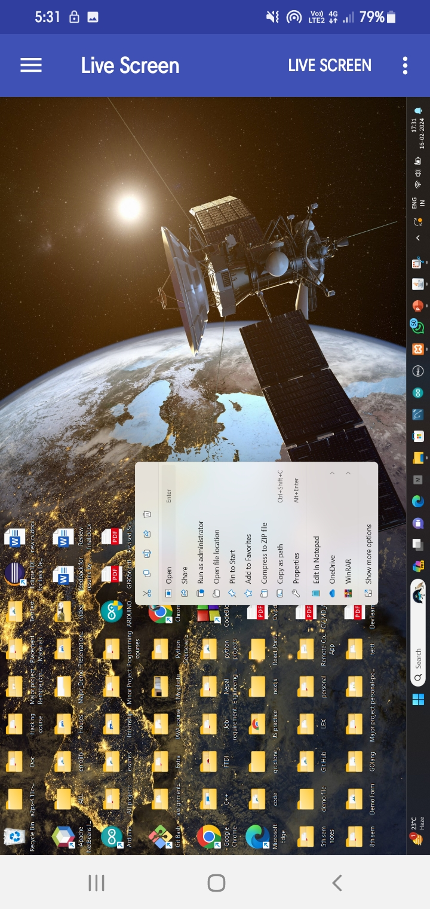 | 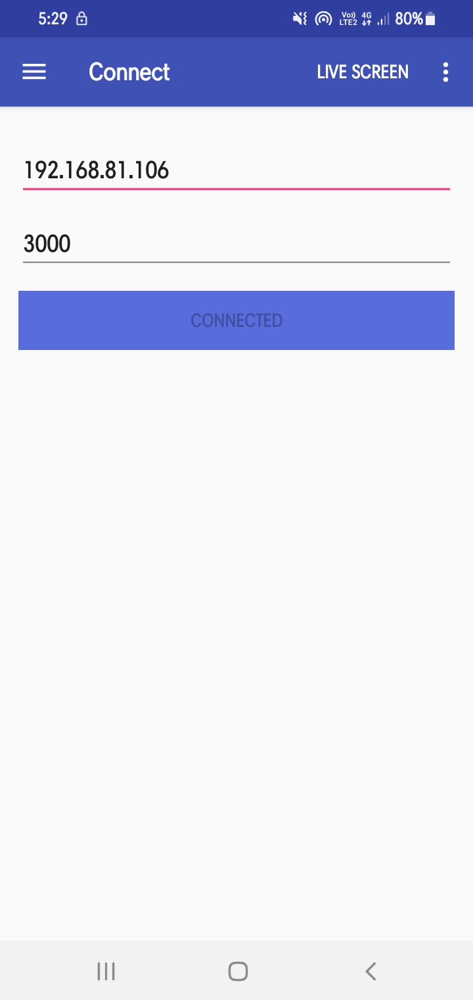|
|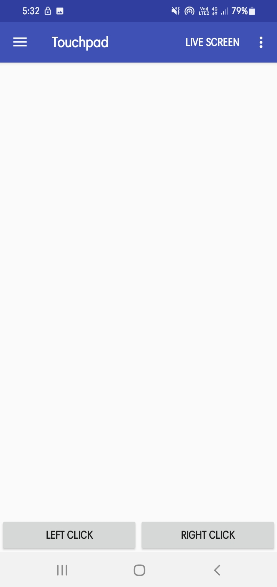 | 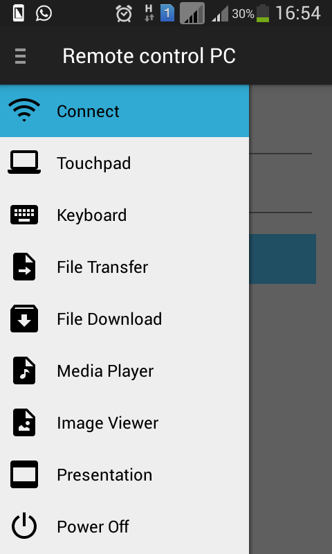|
|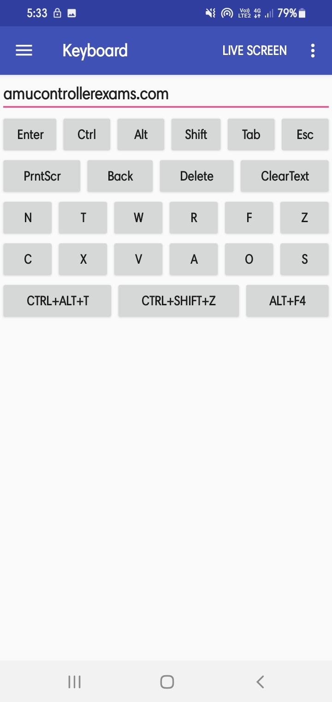 | 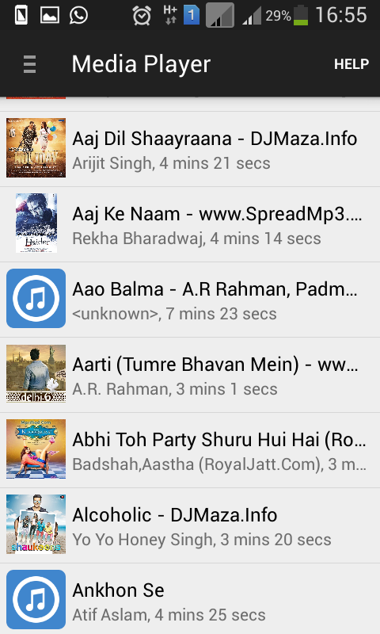|
|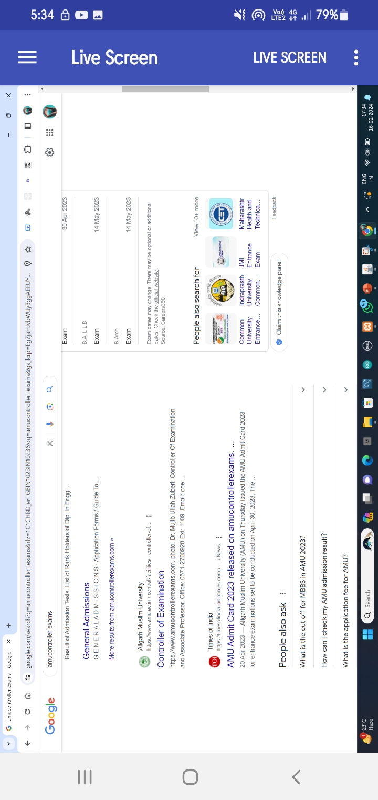 | 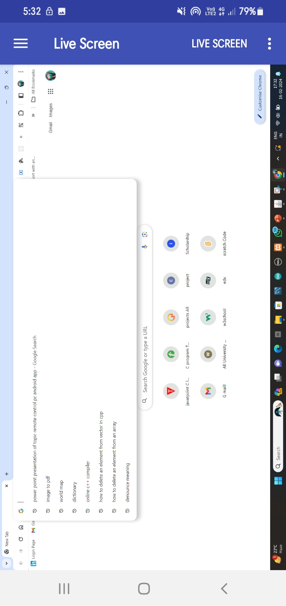 |
|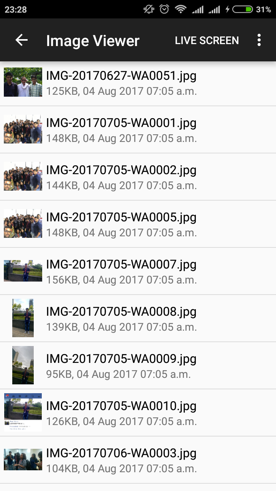 | 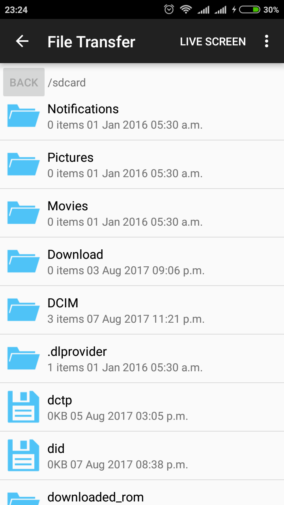|
|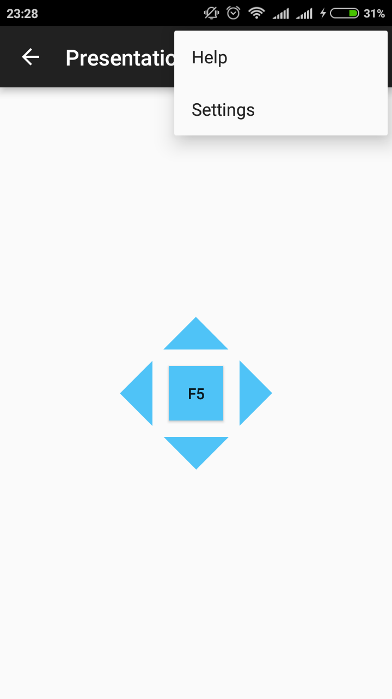 | 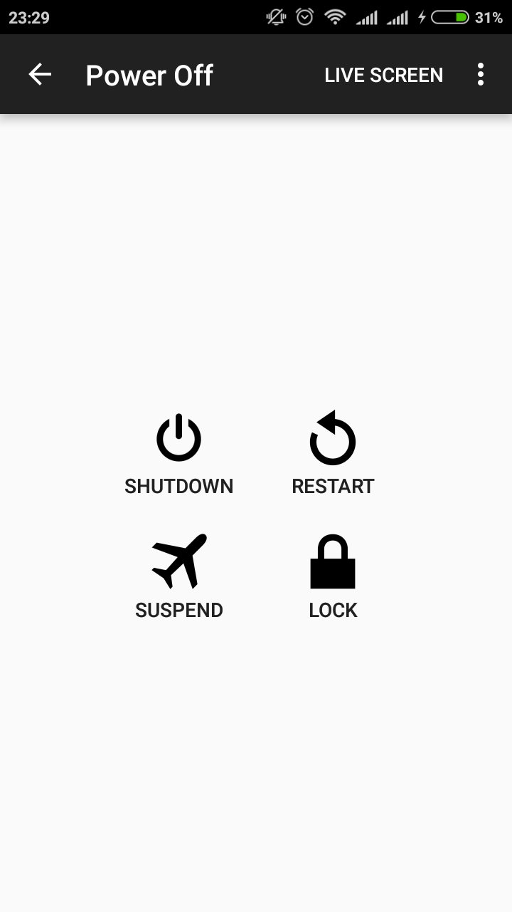|
|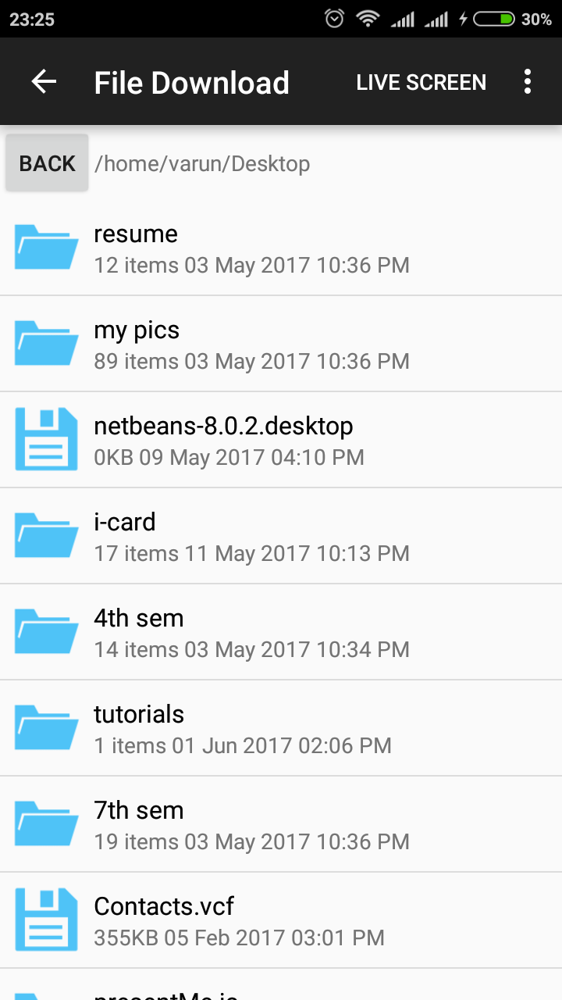 | 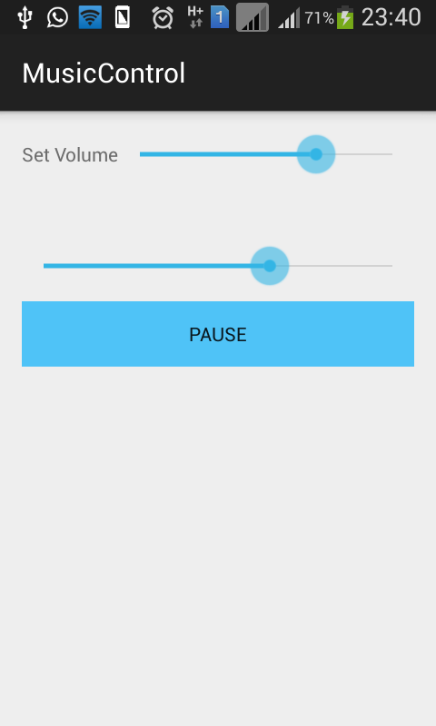|
|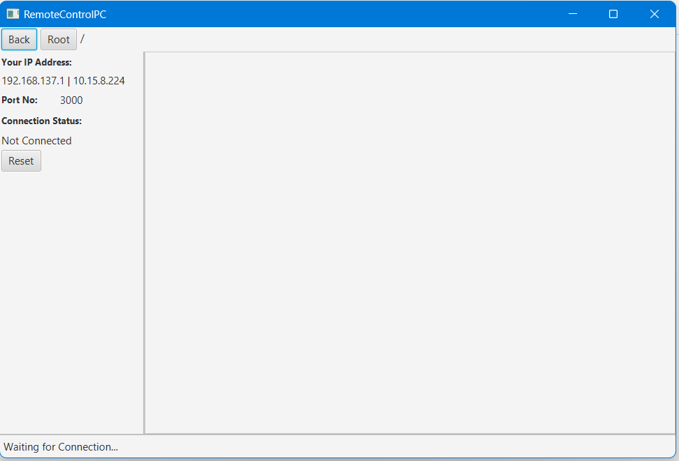 |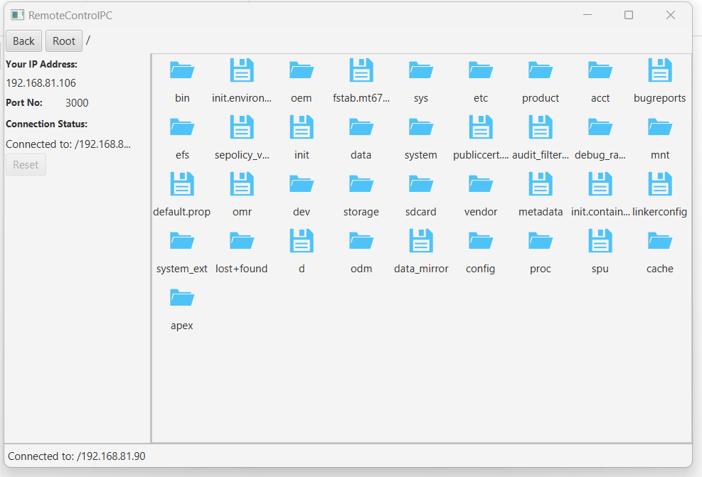 |

## How to contribute?
Desktop part of this project has been developed in Netbeans(Java-FXML) while that of Android part in Android-Studio.

#### Steps to deploy app on your machine-
1. There are three folders-
    1. RemoteControlPC-Studio- Android part, Import in Android Studio 
    2. RemoteControlPC-JavaFXML- Desktop part, Import in Netbeans (Use SceneBuilder)
    3. RemoteControlPC-Libraries- Libraries (Jar file) that is being used in android as well as desktop, Import in Netbeans
2. Library has a dist folder that contains jar file.
3. Add this jar file in build path of Desktop (Netbeans) as well as Android part. See steps below.
4. To change/modify the java files inside library folder, import it in Netbeans and 'clean and build project' after changing.
5. Make sure to clean android as well as desktop part after modifying library files.

#### Steps to add jar file to android as well as dekstop part-
1. For Netbeans-
    1. Right click on project 
    2. Click Properties
    3. Click Libraries
    4. Add JAR/Folder -> Select jar from /Remote-Control-PC-Android-App/blob/main/RemoteControlPC-Libraries/dist/RemoteControlPC-Libraries.jar

#### Testing of android app:
* Android 4.2.2 Samsung(GT-S7582)
* Android 6.0.1 Redmi 4A
* Android 5, API 22 (Emulator)
* Android 7, API 24 (Emulator)

### Releases:
*https://github.com/MdAnayatullah/Remote-Control-PC-Android-App/release

#### For query/issues open Github issue or contact: mdanayatullah143@gmail.com

